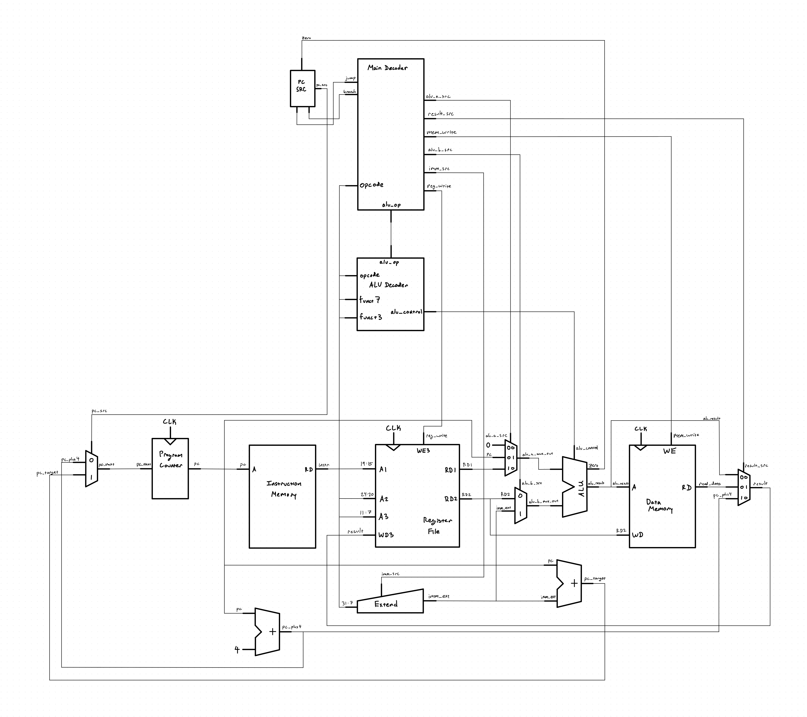

# RISC-V Single-Cycle CPU

A 32-bit single-cycle RISC-V processor implemented in Verilog, based on the architecture presented in *Digital Design and Computer Architecture: RISC-V Edition* by Harris & Harris.

The processor currently implements a 36-instruction subset of RV32I, including integer arithmetic and logic, byte/halfword/word loads and stores, jumps, upper-immediate instructions, and all six conditional branch instructions. The design is verified using a self-checking testbench and will ultimately be synthesized and tested on a Spartan-7 FPGA.

## Status

- Complete single-cycle datapath and control unit
- 36 RV32I instructions implemented
- Self-checking simulation for implemented instructions
- FPGA synthesis and implementation planned in Vivado

## Architecture

The processor uses a single-cycle datapath with separate instruction and data memories, a 32-bit register file, immediate extension, ALU, branch/jump logic, and a centralized control unit. 

Click the schematic to view the full-resolution image.

<a href="images/single-cycle-riscv.jpg">
  
</a>

## Instruction Support

| Type | Implemented Instructions |
| --- | --- |
| R-type | `add`, `sub`, `sll`, `slt`, `sltu`, `xor`, `srl`, `sra`, `or`, `and` |
| I-type arithmetic | `addi`, `slti`, `sltiu`, `xori`, `ori`, `andi`, `slli`, `srli`, `srai` |
| Load | `lw`, `lb`, `lh`, `lbu`, `lhu` |
| Store | `sw`, `sb`, `sh` |
| Branch | `beq`, `bne`, `blt`, `bge`, `bltu`, `bgeu` |
| Upper immediate | `lui`, `auipc` |
| Jump | `jal` |

**Total: 36 instructions**

## Verification

The processor is verified using a self-checking Verilog testbench that executes machine-code test programs and checks the resulting architectural state.

The current test suite verifies:

- Arithmetic and logical operations
- Signed and unsigned comparisons
- Shift operations
- Jump and branch control flow
- Upper-immediate instructions
- Byte, halfword, and word loads/stores
- Signed and unsigned load extension
- Register write-back behavior

Simulation results are checked automatically against expected register values, while generated VCD waveforms can be inspected for additional debugging and timing analysis.

## Repository Structure

```text
.
├── images/      # Datapath schematics
├── programs/    # Hex-encoded test programs
├── sim/         # Verilog testbenches
├── src/         # Processor RTL modules
├── run.sh       # Compile and simulation script
└── README.md
```

## Running the Testbench

The project uses Icarus Verilog for simulation.

To compile and run the main CPU testbench:

```bash
./run.sh
```

The script:

- Compiles the Verilog modules in `src/`
- Uses `sim/TopModule-tb.v` as the top-level testbench
- Runs the simulation with `vvp`
- Reports self-checking test results in the terminal
- Saves the simulation output to `sim_output.txt`
- Generates `topmodule_tb.vcd` for waveform inspection

The generated VCD file can be opened in a waveform viewer such as GTKWave.

## Roadmap

- [ ] Implement `jalr`
- [ ] Complete planned RV32I instruction support
- [ ] Synthesize the processor in Vivado
- [ ] Analyze timing and FPGA resource utilization
- [ ] Implement and test the processor on a Spartan-7 FPGA

## Reference

David Money Harris and Sarah L. Harris, *Digital Design and Computer Architecture: RISC-V Edition*.