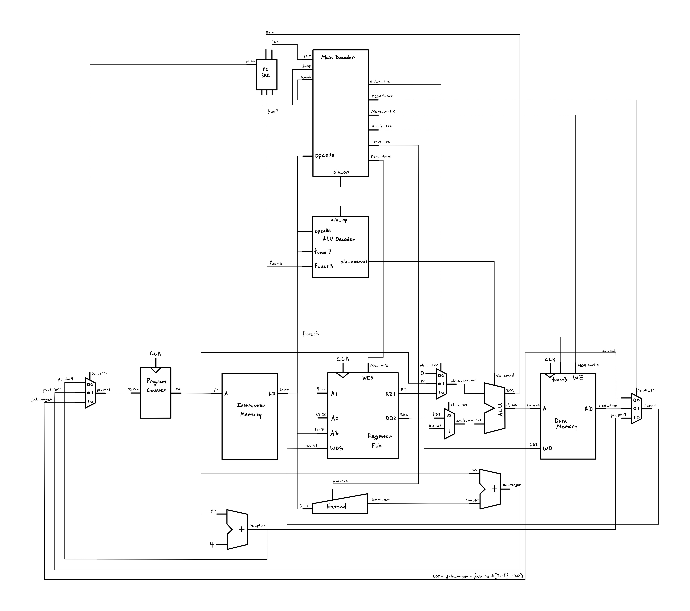

# RISC-V Single-Cycle CPU

A 32-bit single-cycle RISC-V processor implemented in Verilog, based on the architecture presented in Digital Design and Computer Architecture: RISC-V Edition by Harris & Harris.

The processor currently implements 37 RV32I instructions, including integer arithmetic and logic, byte/halfword/word loads and stores, conditional branches, direct and indirect jumps, and upper-immediate instructions. The design is verified using a self-checking testbench and will ultimately be synthesized and tested on a Spartan-7 FPGA.

## Status

- 37 RV32I instructions implemented
- Self-checking functional verification
- Synthesized and implemented for Spartan-7 XC7S50
- Timing closure achieved at ~64.7 MHz

## Architecture

The processor uses a single-cycle datapath with separate instruction and data memories, a 32-bit register file, immediate extension, ALU, branch/jump logic, and a centralized control unit.

The next-PC logic supports sequential execution, PC-relative branches and jumps, and register-relative jalr targets.

Click the schematic to view the full-resolution image.

<a href="images/single-cycle-riscv-1.jpg">
  
</a>

## Instruction Support

| Type | Implemented Instructions |
| --- | --- |
| R-type | `add`, `sub`, `sll`, `slt`, `sltu`, `xor`, `srl`, `sra`, `or`, `and` |
| I-type arithmetic | `addi`, `slti`, `sltiu`, `xori`, `ori`, `andi`, `slli`, `srli`, `srai` |
| Load | `lw`, `lb`, `lh`, `lbu`, `lhu` |
| Store | `sw`, `sb`, `sh` |
| Branch | `beq`, `bne`, `blt`, `bge`, `bltu`, `bgeu` |
| Upper immediate | `lui`, `auipc` |
| Jump | `jal`, `jalr` |

**Total: 37 instructions**

## Verification

The processor is verified using a self-checking Verilog testbench that executes machine-code test programs and checks the resulting architectural state.

The current test suite verifies:

- Arithmetic and logical operations
- Signed and unsigned comparisons
- Shift operations
- Taken and not-taken branch behavior
- Direct and register-relative jumps
- jal and jalr link-address write-back
- jalr target alignment behavior
- Upper-immediate instructions
- Byte, halfword, and word loads/stores
- Signed and unsigned load extension
- Partial memory writes
- Register write-back behavior

Simulation results are checked automatically against expected register values, while generated VCD waveforms can be inspected for additional debugging and timing analysis.

## FPGA Implementation

The processor was synthesized, placed, and routed in AMD Vivado for the
Real Digital Urbana board's Spartan-7 FPGA (`xc7s50csg324-1`).

The Vivado clock constraint is stored in:

[`timing/timing.xdc`](./timing/timing.xdc)

Instruction memory is initialized from:

[`programs/program.mem`](./programs/program.mem)

`IMem.v` uses conditional compilation so that Icarus Verilog and Vivado
can reference the same memory initialization file from their respective
working directories.

### Timing

| Metric | Result |
| --- | --- |
| Initial target frequency | 100 MHz |
| Initial target period | 10.00 ns |
| Initial WNS | -4.431 ns |
| Minimum verified passing period | 15.45 ns |
| Maximum verified clock frequency | ~64.7 MHz |

The implemented design achieved timing closure at a clock period of
15.45 ns, corresponding to approximately 64.7 MHz.

### Resource Utilization

| Resource | Used | Available | Utilization |
| --- | ---: | ---: | ---: |
| LUTs | 1,055 | 32,600 | 3.24% |
| LUTRAM | 172 | 9,600 | 1.79% |
| Flip-Flops | 32 | 65,200 | 0.05% |
| BUFG | 1 | 32 | 3.13% |

Memory structures are primarily implemented using distributed RAM,
consistent with the asynchronous-read behavior required by the
single-cycle datapath.

### Design Analysis

As expected for a single-cycle architecture, the processor's critical
timing path occurs through a load instruction. A load must complete
instruction fetch, register-file access, address calculation, data-memory
access, and register write-back within a single clock cycle.

This long combinational path prevented the design from meeting the
initial 100 MHz timing target. Timing closure was achieved at
approximately 64.7 MHz on the Spartan-7 XC7S50.

The design uses relatively few FPGA resources, with approximately 3.35%
of available LUTs utilized. The register file and memory structures are
primarily implemented using distributed RAM, which is consistent with
the asynchronous-read behavior used by the single-cycle datapath.

This implementation provides a useful baseline for a future pipelined
processor. A pipelined architecture would divide the current critical
path across multiple stages, potentially allowing a significantly higher
clock frequency at the cost of additional pipeline registers, forwarding
logic, and hazard-control circuitry.

## Repository Structure

```text
.
├── images/          # Datapath schematics
├── programs/        # Memory initialization program
│   └── program.mem
├── sim/             # Verilog testbenches
├── src/             # Processor RTL modules
├── timing/          # Vivado timing constraints
│   └── timing.xdc
├── run.sh           # Icarus Verilog simulation script
└── README.md
```

## Running the Testbench

The project uses Icarus Verilog for simulation.

To compile and run the main CPU testbench:

```bash
./run.sh
```

The script:

- Compiles the Verilog modules in `src/`
- Uses `sim/TopModule-tb.v` as the top-level testbench
- Runs the simulation with `vvp`
- Reports self-checking test results in the terminal
- Saves the simulation output to `sim_output.txt`
- Generates `topmodule_tb.vcd` for waveform inspection

The generated VCD file can be opened in a waveform viewer such as GTKWave.

## Roadmap

- [x] Complete single-cycle processor datapath and control
- [x] Verify implemented RV32I instructions
- [x] Synthesize and implement on Spartan-7
- [x] Characterize timing and FPGA resource utilization
- [ ] Add memory-mapped I/O and board-level peripherals
- [ ] Develop a pipelined processor implementation

## Reference

David Money Harris and Sarah L. Harris, *Digital Design and Computer Architecture: RISC-V Edition*.